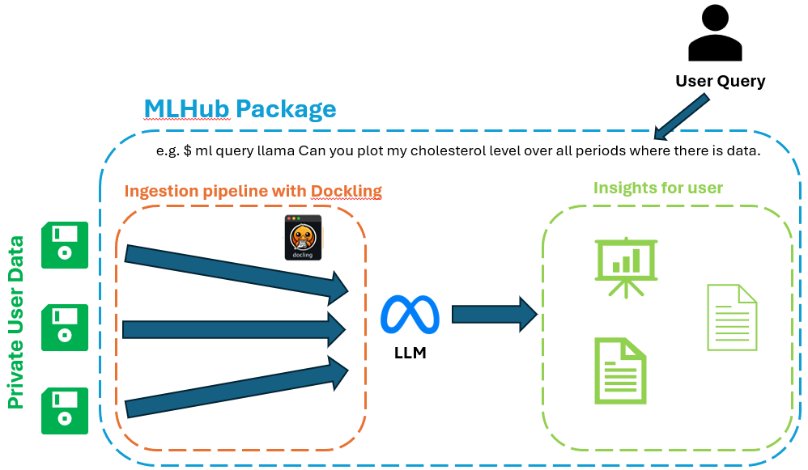

# An MLHub Package for Personalised Health Queries

🚧 **Note**: This work is still under construction.


This [MLHUB](https://mlhub.au/) package intends to develop a Retrieval-Augmented Generation system for personalized health-care queries with large language models, and private health care data. Privacy is intended to be preserved and hence the system has to run locally to achieve that probably. A high-level plan of the project is illustrated below.



## Usage

* To install mlhub (Ubuntu 24.04 LTS)
  ```bash
  pip3 install mlhub
  ml configure
  ```

* Download a [sample blood test PDF](https://www.testing.com/wp-content/uploads/2021/07/CBC-sample-report-with-notes_0.pdf). Note down the full path of ```sample_health_data``` folder.
  ```bash
  mkdir sample_health_data
  cd sample_health_data
  wget https://www.testing.com/wp-content/uploads/2021/07/CBC-sample-report-with-notes_0.pdf
  ```

* To install and configure the package
  ```bash
  ml install ar4152/llama@main
  ml configure llama
  [enter sample_health_data folder path when prompted.]
  ml readme llama
  ml commands llama
  ```

* Command line tools
  ```bash
  ml query llama <QUERY>
  ```

* Quick test

  ```bash
  ml query llama "'What is my white blood count? Is it normal?'"
  ```
